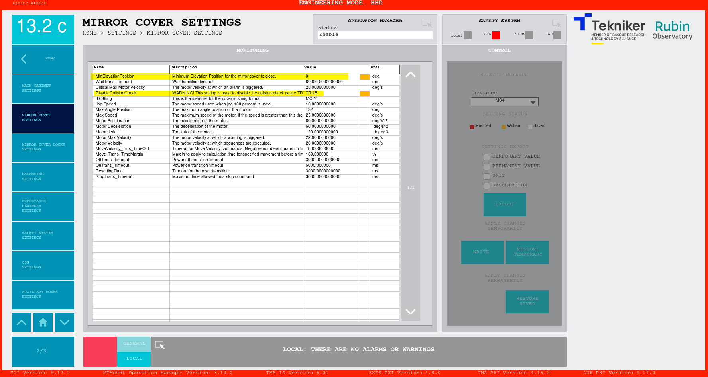

# Move Mirror Cover without checks

>[!IMPORTANT]
> This procedure must be performed by authorized, trained personnel with extreme caution. Use only for specific tests and under visual supervision.

<!-- original
This file contains the explanations for moving the mirror cover without checking the elevation position or checking the
collision possibilities between them.

**ONLY for specific tests**, not safe without visual supervision of the movements.

There are some tests that require moving the Mirror Cover at a position it was not designed for, elevation angles less
than 15 deg. At this range of Elevation angles, the mirror cover doesn't behave as it was designed, the fabric of the
mirror cover folds to the wrong side in some situations, therefore, this procedure is manual and should be carefully
executed.

The new introduction section adds more context and mentions the verification parameters that the 
original document has in the middle of the procedure.
-->

## Introduction

The four mirror covers operate only above a minimum TMA elevation of 15 degrees. Checks on TMA elevation and mirror-cover collisions prevent the fabric from folding incorrectly below 15 degrees and avoid damage.

For some engineering tasks, operating the mirror covers below 15 degrees is necessary. This document describes the procedure for doing so at the horizon, which requires disabling verifications in the TMA EUI Mirror cover settings. It must always be done in situ, manually, and with extreme caution.

The verification parameters are:

`MinElevationPosition` : minimum value of elevation allowed for moving the mirror cover, common for all mirror covers.

`DisableCollisionCheck`:  boolean that checks for each mirror cover the rest of the mirror cover positions. Each mirror cover has an instance, accessed using the top right control that says instance.  It should always be FALSE during regular operations.

<!-- new section -->
## Precondition

* An engineering task requires to operate the mirror covers when TMA elevation is below 15 degrees.

* Be authorized to perform this procedure.

<!--
Original text
## Steps to move the mirror cover

- Go to the Mirror Cover window
- Power off the mirror cover
- Go to the mirror cover settings window
- Change the settings: `MinElevationPosition` and `DisableCollisionCheck`, just write them, we don't want to save these,
  as these are just for a test.
  - *MinElevationPosition*: this is the minimum value of elevation allowed for moving the mirror cover, we can set this
    to 0 for horizon movements. This setting is a single one for all the mirror covers, so it must be changed just once.
  - *DisableCollisionCheck*: this is a boolean that disables checking the rest of the mirror cover positions, set it to
    `true` to disable the checks. This setting is independent for each of the mirror covers, so this one must be changed
    for each of the instances, remember the mirror cover has 4 instances, this can be changed in the EUI using the top right
    control that says *instance*.

  

- Go back to the Mirror Cover window
- Power on the selected mirror cover
- Move each of the mirror covers individually at the defined sequence order below, at a maximum speed of 0.5 deg/s
- There is an order that must be followed if we want to retract the mirror cover

Below the proposed procedure. 

-->
## Procedure

<!-- I added this note at the beginning that was mentioned after in the original 
-->
> [!IMPORTANT]
> Retracting the mirror covers at horizon:
>
> 
> To provide access from the Deployable Platforms there is no need to fully retract them (130 degrees), instead retract to ~ 40 degrees for each mirror cover.

<!-- I copy most of the procedure, but I added links 
PLEASE CHECK specially step 4 as Im not sure of the instances names and the secuence.
-->
1. Go to Home > Monitor & Control > Mirror Cover System > [Mirror Cover General View](https://ts-tma.lsst.io/docs/tma_eui-manual-english/02_Monitor&Control/021_MirrorCoverGeneralView.html#mirror-cover-general-view-screen-main-view ).
2. Power OFF ALL the mirror covers.
3. Got to Home > Settings > [Mirror cover settings](https://ts-tma.lsst.io/docs/tma_eui-manual-english/03_Settings/010_MirrorCoverSettings.html)
4. Change the settings by writing **DO NOT SAVE THEM**:
    1. Select `MinElevationPosition`  set to `0` and  WRITE.
    2. Disable the collision check for each of the 4 instances (refer to the image in the [Mirror Cover Setting window](https://ts-tma.lsst.io/docs/tma_eui-manual-english/03_Settings/010_MirrorCoverSettings.html) instances: MC1, MC2, MC3, MC4)
         1. Set DisableCollisionCheck to `TRUE`
         2. Select one instance
         3. Press WRITE
         4. Repeat steps ii and iii for each instance. 
5. Go to Home > Monitor & Control > Mirror Cover System > [Mirror Cover General View](https://ts-tma.lsst.io/docs/tma_eui-manual-english/02_Monitor&Control/021_MirrorCoverGeneralView.html#mirror-cover-general-view-screen-main-view ).
6. Following the order for retract or extend listed below, **FOR EACH** mirror cover:
     1. Power ON the mirror cover you want to operate
     2. Set position in degrees
     3. Set maximum speed of 0.5 deg/s
     4. Press <code>MOVE</code>
     5. Repeat all the sub-steps in step 6 for the other mirror covers in the appropiate order.

<!-- added title -->
### Retract order  

When retracting the mirror covers manually at horizon, the order is:
<!-- I moved this to the start of the procedure
For retracting and clearing the deployable platforms it was checked that a position of ~40deg for each of the covers
>  was enough, there is no need to fully retract them
 -->
1. Mirror cover X-
2. Mirror cover Y+
3. Mirror cover Y-
4. Mirror cover X+

<!-- added title -->
### Extend order

When extending the mirror covers manually at horizon, the order is:

1. Mirror cover X+
2. Mirror cover Y-
3. Mirror cover Y+
4. Mirror cover X-
