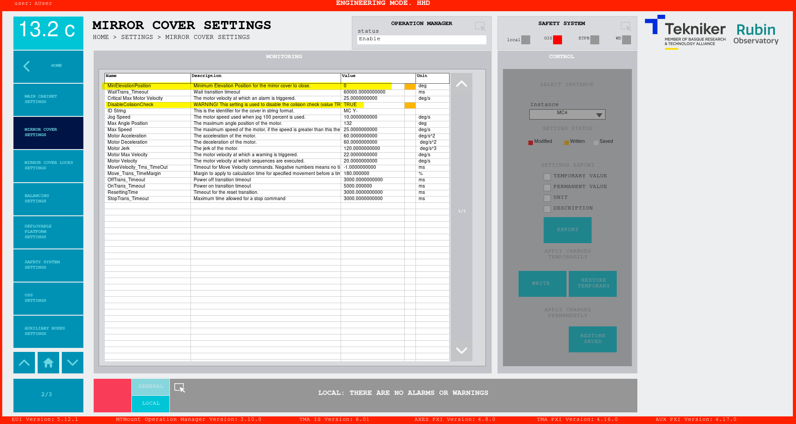

# Move Mirror Cover with out checks

This file contains the explanations for moving the mirror cover without checking the elevation position or checking the
collision possibilities between them.

**ONLY for specific tests**, not safe without visual supervision of the movements.

There are some tests that require moving the Mirror Cover at a position it was not designed for, elevation angles less
than 15 deg. At this range of Elevation angles, the mirror cover doesn't behave as it was designed, the fabric of the
mirror cover folds to the wrong side in some situations, therefore, this procedure is manual and should be carefully
executed.

## Steps to move the mirror cover

- Go to the Mirror Cover window
- Power off the mirror cover
- Go to the mirror cover settings window
- Change the settings: `MinElevationPosition` and `DisableCollisionCheck`, just write them, we don't want to save these,
  as these are just for a test.
  - *MinElevationPosition*: this is the minimum value of elevation allowed for moving the mirror cover, we can set this
    to 0 for horizon movements. This setting is a single one for all the mirror covers, so it must be changed just once.
  - *DisableCollisionCheck*: this is a boolean that disables checking the rest of the mirror cover positions, set it to
    `true` to disable the checks. This setting is independent for each of the mirror covers, so this one must be changed
    for each of the instances, remember the mirror cover has 4 instances, this can be changed in the EUI using the top right
    control that says *instance*.

  {width=70%}

- Go back to the Mirror Cover window
- Power on the selected mirror cover and move it at a speed of maximum 0.5 deg/s
- There is an order that must be followed if we want to retract the mirror cover

Retract order for the mirror cover, manually at horizon:

1. Mirror cover X-
2. Mirror cover Y+
3. Mirror cover Y-
4. Mirror cover X+

Extend order for the mirror cover, manually at horizon:

1. Mirror cover X+
2. Mirror cover Y-
3. Mirror cover Y+
4. Mirror cover X-
